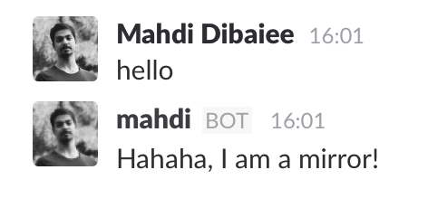

#Sending Messages
> Blessed are those with a voice.

 Okay, so you want to send messages, don't worry, we have you covered.
 
 There are two main methods for sending messages, and two other for updating and deleting messages.
 
 ###sendMessage
 The main method to send a message is `sendMessage`:
 
```javascript
// bot.sendMessage(channel, text, params);
bot.sendMessage('music-recommendation', 'Yeaaaaah!');
bot.sendMessage('joe', 'Hey Joe, how are you?');

bot.sendMessage('general', "I'm pretending to be Joe", { username: 'Joe' });
```

There are three arguments.
`channel` – either name or ID of a channel/group/IM/user, whatever
`text` – self-explanatory
`params` – an object of options to get passed to Slack method [`chat.postMessage`](https://api.slack.com/methods/chat.postMessage).

Normally, RTM API is used to send the message, unless you specify `websocket: false` in params.
If you want to use the options of [`chat.postMessage`](https://api.slack.com/methods/chat.postMessage), you must disable `websocket`.

An error is thrown if the specified channel is not found.

This method returns a promise which resolves to the message object.

###sendAsUser
 This method might look a little scary, and fun at the same time. Using this method you can send a message using a user's icon and username, pretending to be the user! Wait, what?!
 Don't worry, there is always a `BOT` tag near bot's name which indicates this message is sent using a bot, and not the user.
 
 ```javascript
 bot.sendAsUser(user, channel, text, params);
 ```
 
 The arguments are the same as `sendMessage`, except for `user` which is a username/id.
 
 Example:
 
```javascript
const Bot = require('slackbot-api');

const bot = new Bot({ token: 'YOUR_API_TOKEN' });
bot.listen(/Hello/i, message => {
  bot.sendAsUser(message.user, message.channel, 'Hahaha, I am a mirror!');
});
```
 
 
 
 
 #Updating and Deleting messages
  Slack gives us the ability to update and delete our messages. Each message has a `ts` (short for timestamp), which the identifier of messages.
  
```javascript
const msg = await bot.sendMessage('general', 'Hi');
bot.updateMessage('general', msg.ts, 'Hello!?');
```
 