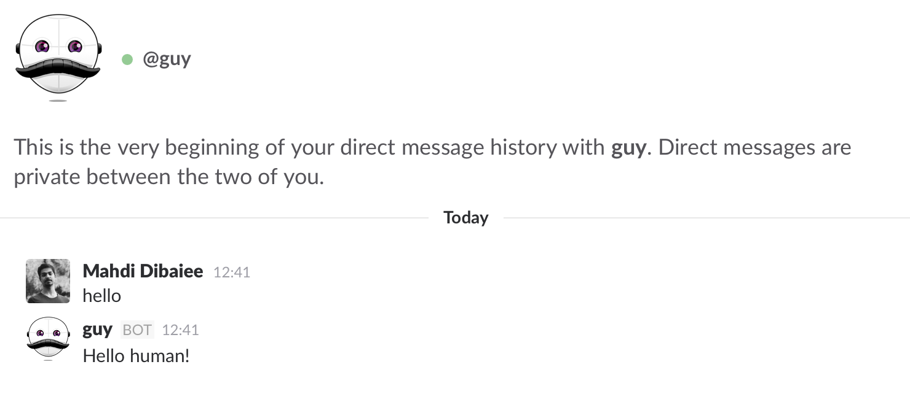

# Introduction
 Hey! This is an introduction to `slackbot-api`, this introduction will get you started with writing a simple Slack Bot, and no, it's not hard!

###Slack Side
 Okay, first things first, we have to create a bot in our Slack Team (if you don't have a slack team, [create one](https://slack.com/)).

To do so, open [Custom Integrations](https://pichak.slack.com/apps/manage/custom-integrations), click **Bots** and **Add configuration**, enter a name (You can just go with Sibe) and done. In the next page, upload an image for your bot (Sibe's avatar!) or choose an emoji. You also find an **API Token** there, that's how you connect to your bot, you need it for the next step!

###Breathing life into your bot
 Now's the time when your bot actually does something.
 Initialize a project:
```bash
 mkdir bot
 cd bot
 npm init -y
 npm install -S slackbot-api
```
 Now create a file, call it whatever you want (e.g. `index.js`) and import `slackbot-api`.
 
```javascript
import Bot from 'slackbot-api';

const bot = new Bot({ token: 'YOUR_API_TOKEN' });
bot.listen(/Hello/, message => {
  message.reply('Hello human!');
});
```

 Alright, now run the program and send "Hello" to your bot! This is the Hello World of the bot world!
 
 
 
 Congratulations, you just made your first bot, and it was easy, wasn't it?
 
 ###Learn more
  A fan of bots already? Explore the documentation and create amazing bots!
  
  Have questions? Join our Slack Team and ask your questions!
  Found a bug? Please fill an issue on GitHub.
  Want to contribute? Read our contribution guide and start hacking! Pull-requests are always welcome!
  
  ###See Also
  The Sibe Bot Platform